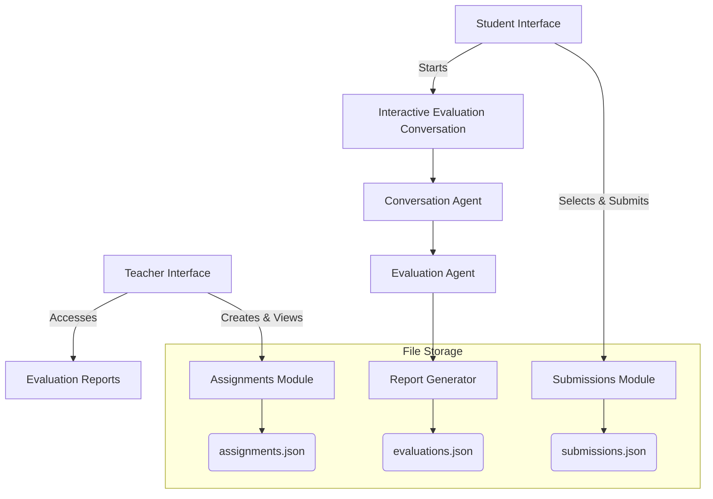
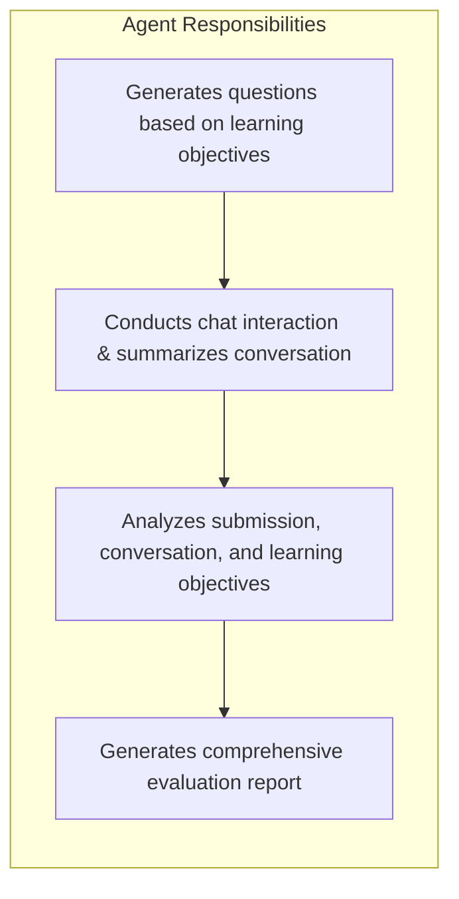
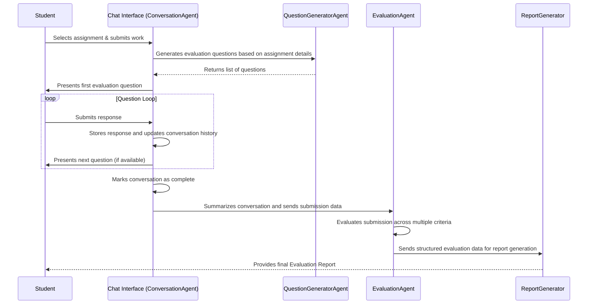

## 1. Overall Application Architecture

Your code implements a multi‐role (teacher and student) web application using Streamlit. The application supports two languages (English and Español) and is designed for the educational assignment evaluation process. Its core functionality includes:

* **Assignment Creation and Management:** Teachers can create assignments by providing details such as instructions, learning objectives, number of evaluation questions, and (optionally) an attached file.
* **Interactive Evaluation Conversation:** Students submit their responses (either via text or file) and then engage in a guided evaluation dialogue. The conversation simulates an oral evaluation using a chat interface.
* **Automated Evaluation and Reporting:** The system uses several agents built with the LangChain framework to generate assessment questions, conduct a conversation with the student, evaluate both the submission and the conversation, and finally compile a structured report for the teacher.

The following diagram illustrates how different modules and file storage components interact:

---

## 2. Directory and File Management

The code defines helper functions to manage necessary storage:

* **`setup_directories()`:** Creates directories for saving assignments, submissions, and evaluations. This ensures that every uploaded file or generated JSON record is stored in the appropriate folder.
* **File Upload and Saving Functions:**
  * `save_uploaded_file(uploaded_file, directory)` saves files uploaded via Streamlit’s file uploader.
  * `read_file(file_path)` and `save_json(data, file_path)` help in reading and writing the assignment, submission, or evaluation data in JSON format.
* **JSON Persistence:**
  Data related to assignments, submissions, and evaluations are maintained in separate JSON files (e.g., `data/assignments.json` and `data/evaluations.json`), which makes it easy to retrieve and update this information.

---

## 3. User Interface and Bilingual Support

### UI Text Translations

A dictionary called `ui_text` is used to store UI strings in both English and Español. The helper function `get_text(key, language)` retrieves the required text based on the chosen interface language. This strategy simplifies supporting multiple languages throughout the app.

### Layout Using Streamlit

* **Sidebar:**
  Contains controls for selecting the interface language, entering the OpenAI API key, and choosing the user role (Teacher or Student).
* **Main Page:**
  Adjusts dynamically based on the user role:
  * **Teacher Dashboard:** Offers tabs for creating an assignment, viewing existing assignments, and examining detailed evaluation reports.
  * **Student Dashboard:** Lets the student choose an assignment, submit their work (with the option to upload files), and then engage in a conversational evaluation process.

---

## 4. LangChain Agent Components

Your implementation leverages several agents to provide dynamic interaction and evaluation capabilities using LangChain’s `LLMChain` and prompt templates.

### a. QuestionGeneratorAgent

**Purpose:**
Generates a set of questions based on the assignment instructions and learning objectives. It prepares a prompt (in the chosen language) for generating questions that assess whether a student meets the defined learning objectives.

**Workflow:**

1. The agent creates a prompt that combines assignment instructions with a formatted list of learning objectives.
2. It then runs the prompt chain with the specified number of questions.
3. Finally, it parses the resulting text (removing any bullet markers or numbering) to extract clear, direct questions.

### b. ConversationAgent

**Purpose:**
Manages the interactive chat with the student. This agent:

* Starts the conversation by presenting an introductory message.
* Iterates through a list of predefined or dynamically generated questions.
* Records student responses and maintains an updated conversation history.

**Additional Role:**
Once the conversation ends, it can generate a concise summary by feeding the entire dialogue into a summarization prompt. This summary helps later during the evaluation phase.

### c. EvaluationAgent

**Purpose:**
Performs a detailed analysis of the student’s submission and conversation.

**Steps Included:**

* **Multi-Stage Evaluation:**
  * **Part 1 (Comprehension and Authenticity):** Evaluates whether the student understands the material and whether their work appears original.
  * **Part 2 (Learning Objectives):** Examines how well the student’s submission aligns with the specified learning objectives.
  * **Part 3 (Overall Quality):** Assesses the overall quality regarding clarity, organization, and depth.
* **JSON Structuring:**
  After combining these evaluations, another prompt is used to convert the raw evaluation text into a structured JSON format. This JSON includes scores and feedback for each evaluation criterion (comprehension, authenticity, learning objectives, and overall quality).

### d. ReportGenerator

**Purpose:**
Takes the structured evaluation data and generates a comprehensive report. The final report includes sections such as:

* **Executive Summary**
* **Detailed analysis** for learning objectives, comprehension, and authenticity
* **Overall quality** of the submission
* **Specific recommendations** for improvement

**Output:**
A detailed text report that teachers can use to understand a student’s performance along with actionable feedback.

### Agent Flow Diagram

The following diagram summarizes the interaction between the different LangChain agents:

---

## 5. Session Management and State Handling

* **Streamlit Session State:**
  The code initializes and uses session state variables to persist conversation history, maintain the list of dynamic learning objectives, track student responses, and control the state of multi-step processes (e.g., conversation progress, evaluation completion).
* **Dynamic Updates:**
  The conversation state is updated with every chat input using Streamlit’s built-in `st.chat_message` and `st.chat_input` functions. This helps maintain a seamless conversation, which is particularly important when simulating an oral evaluation.

---

## 6. Role-Specific Interfaces

### Teacher Interface

* **Assignment Creation:**
  Teachers fill out a form with the assignment name, instructions, number of questions, language preference, and learning objectives. There is also an option to upload a supporting document.
* **Assignment and Report Viewing:**
  A tab-based system lets teachers review created assignments, inspect details (like instructions, learning objectives, and attached files), and delete assignments if needed. There is a dedicated section for viewing detailed evaluation reports for each assignment.

### Student Interface

* **Assignment Submission:**
  Students select from available assignments, read the details, and submit their text response or attach a file. Once submitted, the app automatically transitions into an interactive evaluation conversation.
* **Interactive Chat:**
  The conversation agent asks questions one at a time, and the student’s responses are recorded. When the conversation concludes, the system then generates an evaluation report which is saved and later made accessible for the student to review.

---

## 7. Integration with the SoW.pdf Document

You also uploaded a PDF file (SoW.pdf) that contains a detailed Statement of Work. This document outlines:

* An overview of the software evaluation system.
* Detailed descriptions of processes (e.g., evaluation methodology, conversation flow, security measures, and reporting structures).
* Additional design details such as business plans, implementation timelines, and technical architecture.

While the main code provided is self-contained and focuses on the application logic and user interface, the SoW.pdf serves as a supporting document that outlines the broader context and requirements for the system. You might consider:

* **Cross-Referencing:**
  Verifying that key functionalities from the SoW (like dynamic question generation, multi-stage evaluation, and security measures during the chat) are implemented in your code.
* **Documenting:**
  Linking sections of your code to the corresponding parts of the SoW to maintain traceability and ensure that all project requirements are addressed.
* **Dynamic Integration:**
  If needed, additional parsing routines could be added to extract sections from the SoW for display within the app or for dynamic configuration adjustments.

---

## 8. Final Thoughts and Next Steps

Your code is a robust implementation that leverages modern techniques in AI-assisted educational evaluation. Here are some possible next steps or enhancements:

* **Testing and Debugging:**
  Ensure thorough testing with sample assignments and submissions to verify that the dynamic conversation and evaluation reports are produced as expected.
* **User Experience Improvements:**
  Consider refining the layout or adding visual indicators (e.g., progress bars during the conversation, graphs in the report) to enhance usability.
* **Security Enhancements:**
  Implement additional measures for handling file uploads securely and possibly integrate plagiarism detection tools if needed.
* **Integration with External Data:**
  If desired, incorporate parts of the SoW.pdf into the application interface—for example, by adding a reference section or providing context on how the evaluation system meets business objectives.

---

## 9. Student Evaluation Conversation Flow

The following sequence diagram shows how a student's evaluation conversation proceeds—from assignment submission to obtaining the final evaluation report:

